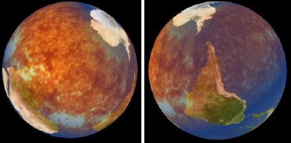

# Shader-Effects-Processing

This code implements an Icosahedron class (Ported to Processing 2.0b8 by Amnon Owed (10/05/2013)).
The levels of the icosahedron can be manipulated to generate a spheral object.
3 different textures can be applied to the icosahedron which can be blended together using GLSL shaders.

Tutorial
------------------------------------------------
 Tutorial:
 
-Select the subdivision via the 'Icolevel' slider, use the 'Rotate' button to rotate the camera around the shape.
 
-In order to check performance, view the frame rate label which is placed in the left hand corner.
 
-To mix multiple texture first select a texture of your choice using the 'Select Texture' drop-down list and then click the 'Mix button'

-Proceed to select the Mixing mode via the 3 buttons (Subtle, Regular or Obvious)

-You can then click on the 'Fade' button which cycles through textures by fading them on top of each other
 
 -It is recommended to use 'Fade' effect, with no rotation on

Example: Regular Mxing Mode

